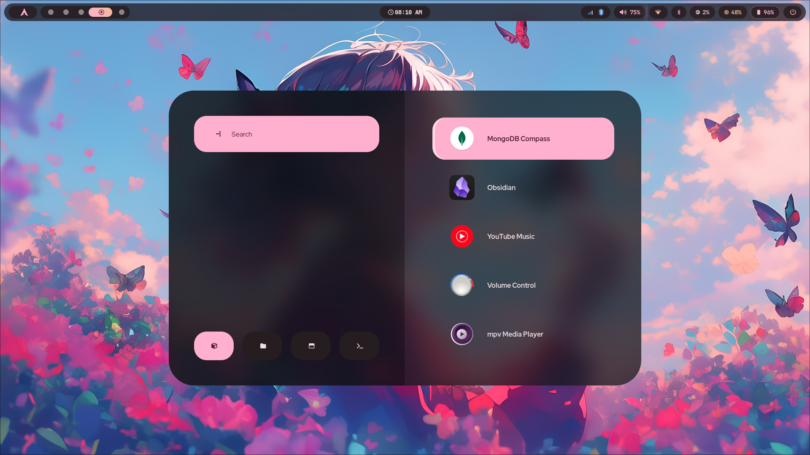
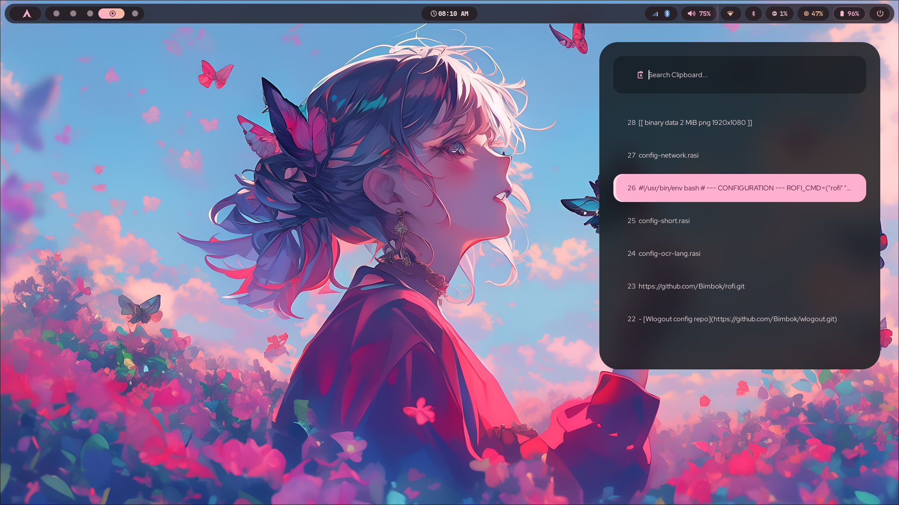
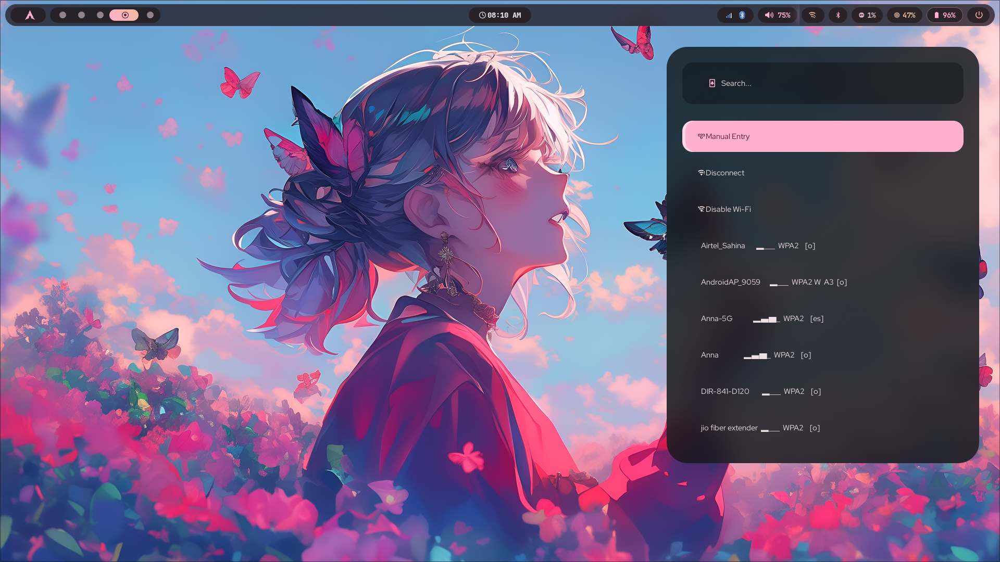
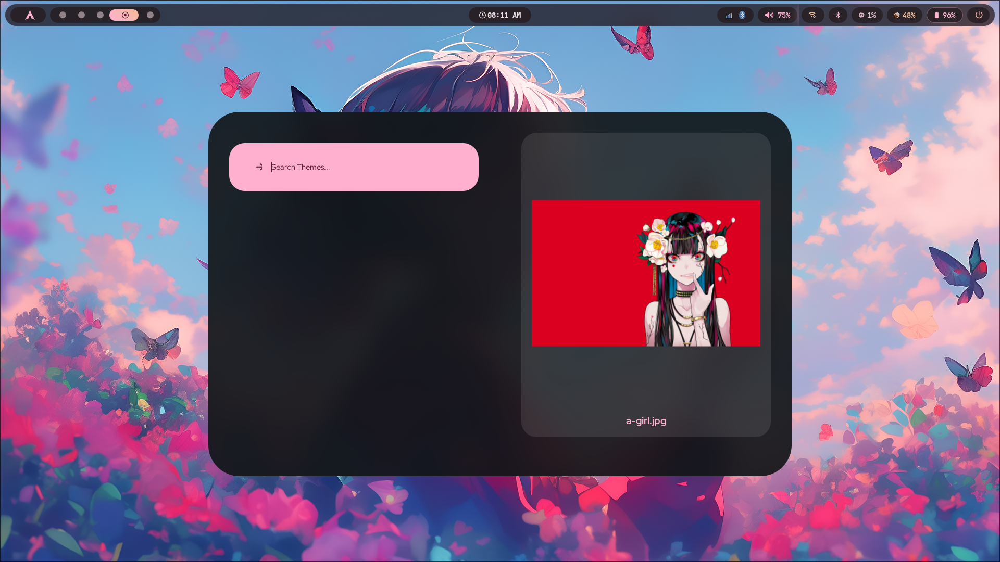

# Rofi: Refined Glass Edition

A modern, highly-aesthetic Rofi configuration featuring a **Glass-Split** layout, **Material 3 (Matugen)** dynamic coloring, and a unified design language across all system menus.

## 🖼️ Gallery

|                       App Menu                       |                       Clipboard History                       |
| :--------------------------------------------------: | :-----------------------------------------------------------: |
|  |  |

|                       Wallpaper Selector                       |                      Network & Scripts                       |
| :------------------------------------------------------------: | :----------------------------------------------------------: |
|  |  |

## ✨ Key Features

- **Glass-Split Sidebar:** A unique layered look where the left panel is slightly darker and more opaque than the right panel, creating depth.
- **Glow-Indicator Selection:** Active items feature a high-contrast left border using the Material 3 `primary-fixed` color.
- **Dynamic Theming:** Fully integrated with `matugen`. Colors are automatically extracted from your wallpaper and updated across all menus.
- **Unified Aesthetic:** Consistent transparency, 60px/30px rounded corners, and Fira Sans typography across App Launchers, Clipboards, and Network menus.

## 🔗 Related Projects

- **Bimagic (Waybar Config):** [Waybar Config](https://github.com/orion-kernel/bimagic.git)

## 📂 Configuration Map

| File                   | Purpose                | Features                                           |
| :--------------------- | :--------------------- | :------------------------------------------------- |
| `config.rasi`          | **Main App Launcher**  | Split-pane glass, large icons, full system modi.   |
| `config-themes.rasi`   | **Wallpaper Selector** | Single **Large Preview** (25em) per page.          |
| `config-cliphist.rasi` | **Clipboard History**  | Compact sidebar (Northeast) with "Glow" selection. |
| `config-network.rasi`  | **Wi-Fi & Bluetooth**  | Unified connectivity sidebar for Waybar scripts.   |
| `colors.rasi`          | **The Master Palette** | Auto-generated by Matugen from your wallpaper.     |
| `config-short.rasi`    | **Confirmations**      | Tiny 2-line menu for "Yes/No" prompts.             |

## 🚀 How to Use

### 1. Launching Apps (Main Menu)

Standard Rofi trigger (usually `Super+D` or `Super+R`).

```bash
rofi -show drun -theme ~/.config/rofi/config.rasi
```

### 2. Clipboard History

Triggered by **`Super+V`**. Ensure `cliphist` and `wl-clipboard` are installed.

```bash
cliphist list | rofi -dmenu -theme ~/.config/rofi/config-cliphist.rasi | cliphist decode | wl-copy
```

### 3. Integrated Waybar Scripts

These scripts are located in `~/.config/waybar/Scripts/` and have been updated to use the Refined Glass themes:

- **Wallpaper Selector:** `wallpaper_select.sh`
  - _Theme:_ `config-themes.rasi` (Large Single Preview)
- **Wi-Fi Manager:** `wifi.sh`
  - _Theme:_ `config-network.rasi` (Sidebar Glass)
- **Bluetooth Manager:** `bluetooth.sh`
  - _Theme:_ `config-network.rasi` (Sidebar Glass)

### 4. Dynamic Theme Update

To refresh all colors based on a new wallpaper:

```bash
matugen image /path/to/wallpaper.jpg -m dark
```

## 🛠️ Requirements

- **Rofi (Wayland fork):** For transparency and blur support.
- **Matugen:** For Material 3 color generation.
- **Fira Sans Bold:** The primary font used for titles and indicators.
- **Cliphist & wl-clipboard:** For the clipboard history functionality.
- **A Compositor (e.g., Hyprland):** For the "blurry" rounded corners effect.

---

_Maintained with  by your Rofi Configuration Assistant._
